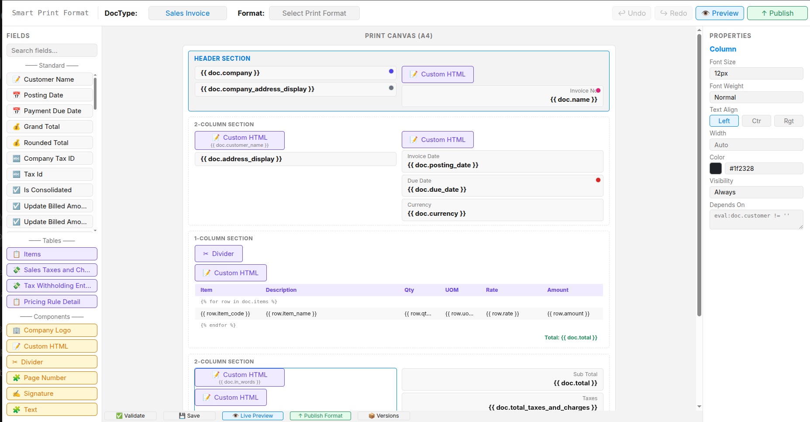

# Smart Print Format

Frappe application that adds a visual, drag-and-drop print format designer on top of Frappe's existing print infrastructure.



## Project Overview

Smart Print Format is an intelligent design layer for Frappe print formats. Instead of hand-writing Jinja and CSS, users build a layout visually on an A4 canvas, and the application validates it, versions it and publishes it as an ordinary Frappe **Print Format**.

The application focuses on:

* Visual drag-and-drop layout design
* Real DocType metadata (no hardcoded fields)
* Server-side layout validation
* Safe Jinja and HTML generation
* Live and server-side print previews
* Reusable print components
* Version history and restore
* Publishing to standard Frappe Print Formats

## Current Scope

The application contains four core DocTypes.

| DocType                               | Purpose                                    | Type          |
| ------------------------------------- | ------------------------------------------ | ------------- |
| **Smart Print Format**                | Main layout record for a target DocType    | Main Document |
| **Smart Print Format Version**        | Saved snapshot of a layout                 | History       |
| **Smart Print Format Component**      | Reusable block placed on the canvas        | Master        |
| **Smart Print Format Component Type** | Category of component (Image, Text, etc.)  | Master        |

## Core DocTypes

### 1. Smart Print Format

Main document representing one print layout for one DocType.

It stores:

* Title and description
* Target DocType
* Linked Print Format
* Status (Draft, Active, Archived)
* Current version number
* Layout JSON
* Generated HTML (Jinja template)
* Generated CSS
* Active flag
* Last published on and by

Naming series:

`SPF-.#####`

### 2. Smart Print Format Version

Snapshot created every time a changed layout is saved or published.

It stores:

* Smart Print Format
* Version number
* Layout JSON
* Generated HTML and CSS
* Created by and created on
* Change summary
* Published flag

Naming series:

`SPFV-.#####`

### 3. Smart Print Format Component

Reusable building block shown in the **Components** palette.

It stores:

* Component name
* Component type
* Description
* Configuration JSON (default settings)
* Thumbnail SVG
* Active status

Default components shipped as fixtures:

* Company Logo
* Custom HTML
* Divider
* Page Number
* Signature
* Text

Named by: `component_name`

### 4. Smart Print Format Component Type

Category that decides how a component is rendered.

It stores:

* Type name
* Description
* Active status

Supported types: Image, HTML, Divider, Page Number, Signature, Text.

Named by: `type_name`

## Designer Interface

The designer is a Vue 3 single-page application served at `/smart-print`.

| Area              | Purpose                                                                 |
| ----------------- | ----------------------------------------------------------------------- |
| **Top Bar**       | DocType and Print Format selection, Undo, Redo, Preview, Publish        |
| **Fields**        | Standard fields, child tables and components of the selected DocType    |
| **Print Canvas**  | A4 page with Header, 1/2/N-column body sections, Table and Footer       |
| **Properties**    | Font size, weight, alignment, width, colour, visibility and conditions  |
| **Bottom Bar**    | Validate, Save, Live Preview, Publish Format, Versions                  |
| **Dashboard**     | List of all Smart Print Formats (`/smart-print/dashboard`)              |
| **Versions**      | Version history with restore (`/smart-print/versions/<name>`)           |

## Business Logic

### Layout Validation

Every layout is checked on the server against `layout_schema.json` and the target DocType's metadata:

* Fields must exist on the DocType and be readable by the user
* Table columns must exist on the child DocType
* Header must be first and footer last
* Conditions may only use safe expressions on `doc` and `row`
* Components must exist and be active

Errors block saving; warnings are returned to the designer.

### HTML Generation

Valid layouts are converted into a Jinja template and CSS:

* Field values use Frappe's own formatting (`doc.get_formatted`)
* Child tables render as tables with optional header and total rows
* Custom HTML is sanitized and Jinja delimiters are neutralized
* The footer section is repeated on every PDF page (with page numbers)

### Versioning

Saving a changed layout creates a new **Smart Print Format Version**. Saving identical content does not create duplicates. Any version can be restored and published again.

### Publishing

Publishing creates or updates the linked Frappe **Print Format**, marks the version as published and sets the Smart Print Format to **Active**. The whole publish runs inside a database savepoint, so a failure leaves nothing half-written.

### Permissions

* **Smart Print Manager** role: create, save and publish formats (created on install, with write access to Print Format)
* **System Manager**: full access
* Users need read access to the DocTypes they design for
* Users without the role can still print with published formats

## External DocType Dependencies

Smart Print Format references existing Frappe DocTypes:

* DocType
* Print Format
* User

These DocTypes are **referenced only**. Print Format records are created or updated only when a format is published.

Smart Print Format does not require ERPNext. It works with any DocType, including ERPNext ones such as Sales Invoice and Purchase Order.

## Development Status

### Completed

* Frappe application setup
* Smart Print Format DocTypes
* Component and Component Type fixtures
* Smart Print Manager role
* Whitelisted REST API
* Layout JSON schema
* Server-side layout validation
* Jinja / CSS generator
* Custom HTML sanitization
* Vue 3 designer (Vite, Pinia, Vue Router)
* Field, table and component palettes
* Drag-and-drop canvas with sections and columns
* Properties panel
* Undo / Redo
* Live preview and server preview with real documents
* Publishing to Print Format
* Version history and restore
* Dashboard view
* Frontend (Vitest) and backend tests

### Planned

* More component types
* Layout templates
* Page size and orientation options
* Import / export of layouts

## Technology

* Frappe Framework 16
* Python
* Vue 3
* Vite
* Pinia
* Vue Router
* Jinja
* MariaDB

## Project Structure

```text
smart_print_format/
├── frontend/                          # Vue 3 designer (Vite)
│   └── src/
│       ├── api/                       # Frappe REST calls
│       ├── components/                # Canvas, palettes, panels, toolbar
│       ├── composables/               # Designer, history, preview logic
│       ├── stores/                    # Pinia store
│       ├── utils/                     # Layout, validation, HTML helpers
│       ├── views/                     # Dashboard, Designer, Versions
│       └── router/
│
├── smart_print_format/
│   ├── smart_print_format/
│   │   └── doctype/
│   │       ├── smart_print_format/
│   │       ├── smart_print_format_version/
│   │       ├── smart_print_format_component/
│   │       └── smart_print_format_component_type/
│   ├── fixtures/                      # Role, component types, components
│   ├── public/frontend/               # Built designer (npm run build)
│   ├── www/                           # /smart-print page
│   ├── tests/
│   ├── api.py                         # Whitelisted API
│   ├── validators.py                  # Layout validation
│   ├── html_generator.py              # Jinja / CSS generation
│   ├── layout_schema.json
│   ├── install.py
│   └── hooks.py
│
├── SmartprintformatBuilder.png
├── pyproject.toml
├── README.md
└── license.txt
```

## Installation

```bash
cd $PATH_TO_YOUR_BENCH
bench get-app $URL_OF_THIS_REPO --branch version-16
bench --site <site> install-app smart_print_format
bench --site <site> migrate

cd apps/smart_print_format/frontend
npm install
npm run build              # writes smart_print_format/public/frontend
cd ../../..
bench build --app smart_print_format
```

Run `npm run build` again after every frontend change. The build output is not committed.

## Usage

Open `http://<site>:8000/smart-print`. Guests are sent to the login page.

1. Pick a **DocType** (for example Sales Invoice)
2. Drag fields, tables and components onto the canvas
3. Adjust them in **Properties**
4. **Validate** and **Save**
5. Check **Live Preview** with a real document
6. **Publish Format** to create the Frappe Print Format
7. Use **Versions** to view or restore earlier layouts

For development with hot reload, run `npm run dev` in `frontend/` and open `http://localhost:5173`. API calls go to the bench on port 8000 (`FRAPPE_SITE=<site> FRAPPE_PORT=<port> npm run dev` to change it). Log in on the bench site first.

## Tests

Frontend (Vitest):

```bash
cd apps/smart_print_format/frontend
npm run test
```

Backend:

```bash
bench --site <site> set-config allow_tests true   # once
bench --site <site> run-tests --app smart_print_format
```

The backend tests create two temporary DocTypes (`SPF Test Invoice` and `SPF Test Invoice Item`) so they don't need ERPNext, and delete them when they finish.

## Workflow

```text
Select DocType
     ↓
Design Layout
     ↓
Validate
     ↓
Save (Version)
     ↓
Preview
     ↓
Publish Print Format
     ↓
Print / PDF
```

## Contributing

This app uses `pre-commit` (ruff, eslint, prettier, pyupgrade):

```bash
cd apps/smart_print_format
pre-commit install
```

## License

MIT
